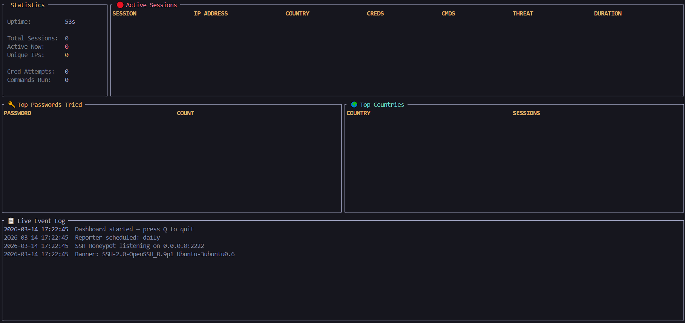

# SSH Honeypot



A production-grade SSH honeypot written in Go. Captures real attacker behaviour — credentials tried, commands executed, geographic origin — and exposes it through a live terminal dashboard and structured reports.

Deploy it on any internet-facing server and watch real attacks happen within minutes.

---

## Architecture

```
ssh-honeypot/
    cmd/honeypot/
        main.go                 Entry point, config loading, wiring
    internal/
        server/
            ssh.go              SSH server — accepts all connections, handles auth
            session.go          Per-session lifecycle management
            shell.go            Fake interactive Linux shell
        logger/
            logger.go           Structured console + file event logging
            db.go               SQLite schema, queries, and operations
        geoip/
            geoip.go            IP geolocation — MaxMind DB or ip-api.com fallback
        analyzer/
            analyzer.go         Threat scoring, pattern detection, session tracking
        dashboard/
            dashboard.go        Live TUI dashboard (tview)
        reporter/
            reporter.go         Markdown + HTML report generator
    data/
        honeypot.db             SQLite database (auto-created)
        host_key                RSA host key (auto-generated)
        sessions/               Per-session JSONL event logs
        reports/                Generated reports
    config.yaml                 Configuration
```

---

## Features

### SSH Server
- Listens on any port (default 2222, use 22 in production)
- Accepts **all connections** — logs every credential attempt
- Presents a realistic `OpenSSH_8.9p1 Ubuntu` banner
- Handles PTY requests, interactive shell, and exec commands
- Auto-generates a 4096-bit RSA host key on first run
- Accepts common default credentials (`root/root`, `admin/admin`, etc.) to lure attackers into the fake shell
- Configurable connection timeout and max concurrent connections

### Fake Shell
Responds to real Linux commands to keep attackers engaged:

| Command | Response |
|---------|----------|
| `whoami`, `id` | Realistic root user info |
| `uname -a` | Fake Linux kernel version |
| `ls /`, `ls /etc` | Realistic directory listings |
| `cat /etc/passwd` | Fake passwd file with real-looking entries |
| `cat /etc/shadow` | Permission denied |
| `cat .env` | **Lure**: Captures access to fake STRIPE/AWS keys |
| `cat db_config.json` | **Lure**: Mock production database credentials |
| `ps`, `w`, `uptime` | Fake process/user lists |
| `ifconfig`, `netstat` | Fake network interfaces |
| `wget`, `curl` | Hangs 2-3 seconds, then "connection timeout" |
| `history` | Empty — good opsec simulation |
| `find / -name passwd` | Returns realistic paths |

### Active Deception (Honey-Traps)
Includes "Honey-Files" in root and home directories containing fake high-value targets:
- `.env` with mock Stripe and AWS credentials
- `db_config.json` with fake production DB strings
- `.bash_history` (simulated empty or seeded)
- `/etc/ssh/sshd_config` realistic server config


### Threat Intelligence
Every session is scored 0-100 based on:
- Number of credential attempts
- Number of unique usernames tried (credential stuffing detection)
- Commands executed (interactive vs scanner)
- Attack speed (automated brute force detection)
- **Client Fingerprinting**: Captures the SSH version string (`libssh`, `Paramiko`, etc.) to identify automated bots vs. manual attackers.

Attack patterns classified as: `scanner` / `brute_force` / `credential_stuffing` / `interactive_session`


### SQLite Database
Structured schema with full query capability:

```sql
sessions     — id, ip, country, city, asn, isp, start_time, end_time, threat_score
credentials  — session_id, username, password, attempt, timestamp
commands     — session_id, command, response, timestamp
patterns     — ip, pattern_type, first_seen, last_seen, count
```

Query examples:
```sql
-- Most common passwords
SELECT password, COUNT(*) as c FROM credentials GROUP BY password ORDER BY c DESC LIMIT 20;

-- Which countries attack most
SELECT country, COUNT(*) FROM sessions GROUP BY country ORDER BY COUNT(*) DESC;

-- Sessions where attacker got a shell
SELECT * FROM sessions WHERE total_cmds > 0 ORDER BY total_cmds DESC;

-- IPs with brute force pattern
SELECT ip, count FROM patterns WHERE pattern_type = 'brute_force' ORDER BY count DESC;
```

### Live Dashboard
Real-time terminal UI showing:
- Active sessions with IP, country, threat level, duration
- Top passwords and usernames being tried
- Top attacker countries
- Live event log with color coding

### Reports
Auto-generated on schedule (daily/hourly) and on shutdown:
- **Markdown** — suitable for GitHub/Notion
- **HTML** — full dark-theme web report with tables
- **JSON** — SIEM-ready structured data for ELK/Splunk ingestion


### Real-time Alerts & Active Defense
- **Discord Integration** — Receive instant notifications when a critical threat is detected.
- **Active IP Blocking** — Select any active session in the dashboard and press `b` to instantly disconnect the attacker and block their IP permanently using `ufw` or `iptables`.
- Configurable threat thresholds for automated alerting.

---

### Prerequisites

- **Go 1.20 or higher** (Required to build the binary)
- **MaxMind GeoLite2 City Database** (Optional, for location maps)
- **Discord Webhook URL** (Optional, for real-time alerts)

#### Installing Go

**On Ubuntu / Debian:**
```bash
sudo apt update
sudo apt install golang -y
```

**On Windows:**
Download and run the installer from the [official Go website](https://go.dev/dl/).

**Verify Installation:**
```bash
go version
```

### 🚀 Quick Start (Production)

Follow these steps for a complete, fresh installation on a Linux server:

1. **Clone & Build**:
   ```bash
   git clone https://github.com/AnassElhamri/ssh-honeypot.git
   cd ssh-honeypot
   go mod tidy
   go build -o honeypot ./cmd/honeypot
   ```

2. **Configure**:
   ```bash
   nano config.yaml
   ```
   *   Change `port: 2222` to **`port: 22`**.
   *   *(Optional)* Add your Discord Webhook URL.

3. **Set Permissions & Run**:
   ```bash
   sudo setcap 'cap_net_bind_service=+ep' ./honeypot
   sudo -E ./honeypot
   ```

---

### 📖 Detailed Usage & Commands

```bash
# Run with live dashboard (Standard)
sudo -E ./honeypot

# Run without dashboard (Plain log output)
sudo ./honeypot --no-dashboard

# Run in background (For long-term deployment)
nohup ./honeypot --no-dashboard &

# Generate a report from current database
./honeypot --report
```

---

## Configuration

Edit `config.yaml`:

```yaml
server:
  port: 2222          # Change to 22 for production (requires root or CAP_NET_BIND_SERVICE)
  max_connections: 100
  banner: "SSH-2.0-OpenSSH_8.9p1 Ubuntu-3ubuntu0.6"

shell:
  hostname: "ubuntu-server"    # What attackers see as the hostname
  response_delay_ms: 80        # Fake processing delay (makes it feel real)

geoip:
  database_path: "data/GeoLite2-City.mmdb"  # Optional — falls back to ip-api.com

reporter:
  schedule: "daily"            # daily or hourly

alerts:
  discord_webhook: "https://discord.com/api/webhooks/..." # Real-time alerts
```

---

## 🚀 Production Deployment (Linux)

To deploy your honeypot on a real production server (like Ubuntu), follow these steps to ensure port 22 is handled safely:

1. **Move your real SSH port**:
   Attackers look for port 22. Move your real SSH to something else (e.g., 2222) first.
   ```bash
   sudo sed -i 's/#Port 22/Port 2222/' /etc/ssh/sshd_config
   sudo systemctl restart ssh
   ```

2. **Allow ports in Firewall (UFW)**:
   ```bash
   sudo ufw allow 2222/tcp  # Your new real SSH port
   sudo ufw allow 22/tcp    # The honeypot port
   sudo ufw enable
   ```

3. **Bind to Port 22 safely**:
   Linux prevents non-root users from binding to ports below 1024. Use `setcap` to allow the honeypot binary to use port 22 without needing `sudo` for every run:
   ```bash
   sudo setcap 'cap_net_bind_service=+ep' ./honeypot
   ```

4. **Run in Background**:
   To keep the honeypot active after closing your session:
   ```bash
   nohup ./honeypot --no-dashboard &
   ```

> [!IMPORTANT]
> **Cloud Provider Note (Oracle, AWS, Azure, Google Cloud)**:  
> If you are using a Cloud VPS, `ufw` is not enough! You **must** also open Ports 22 and 2222 in your Cloud Console's **Security Groups** or **Ingress Rules**. Otherwise, you will be locked out of your server.

### 🛠️ Troubleshooting

#### "Server error: bind: address already in use"
Another process is using your port (usually your real SSH or a previous honeypot run).
Check what's on the port:
```bash
sudo lsof -i :22
sudo lsof -i :2222
```

#### Dashboard not appearing
- Ensure `enabled: true` is set in `config.yaml` under `dashboard`.
- Try running with `sudo -E ./honeypot` to preserve terminal environment variables (like `$TERM`).

#### GeoIP not showing countries
- Ensure `data/GeoLite2-City.mmdb` is present in the project folder.
- If missing, the tool will automatically try to use `ip-api.com` (requires internet access).

---

## 🛡️ License

This project is licensed under the MIT License - see the [LICENSE](LICENSE) file for details.
